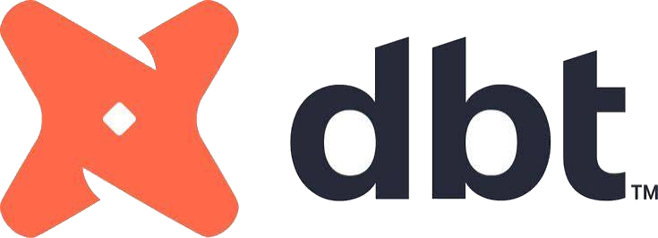
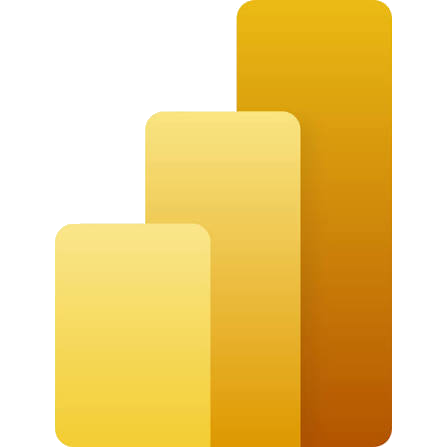
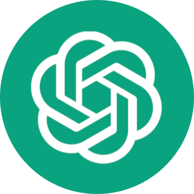
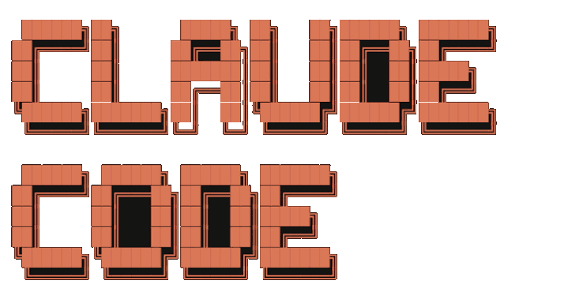
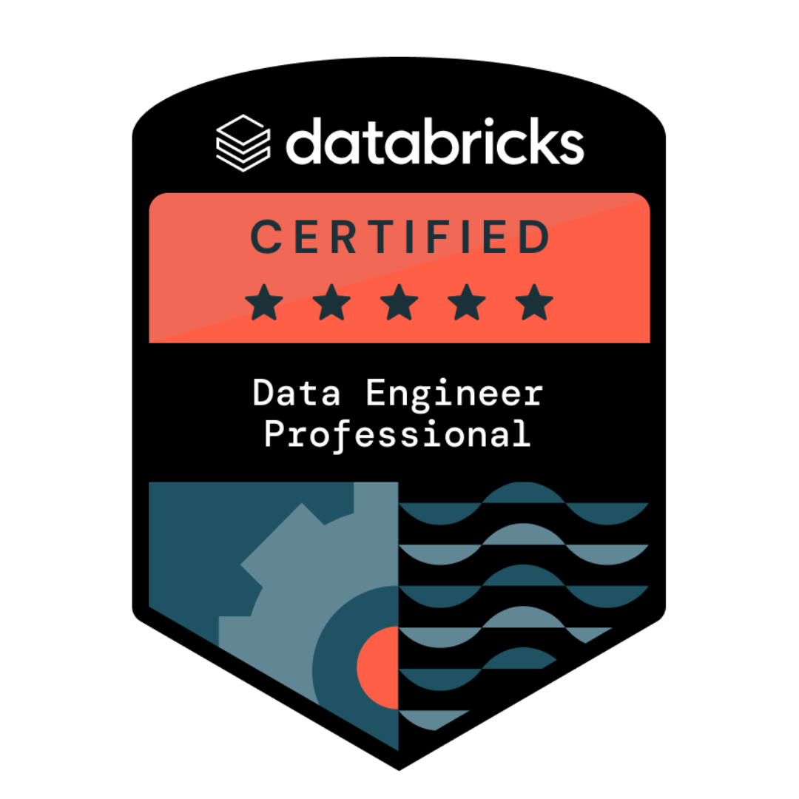
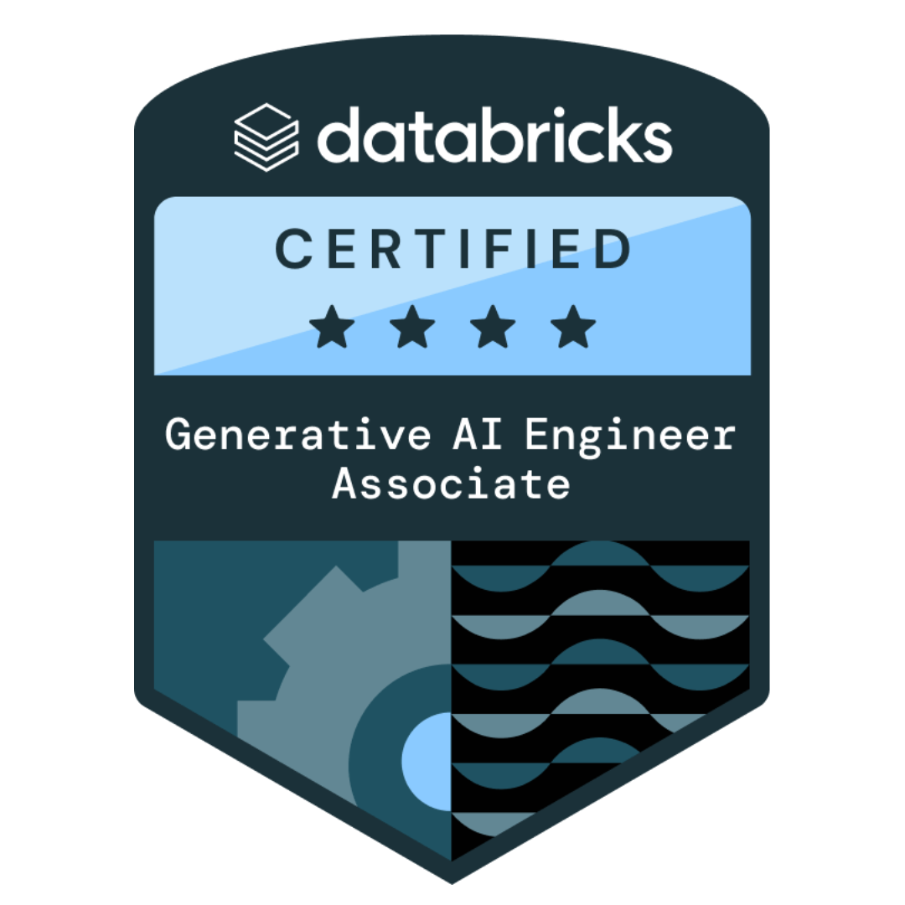
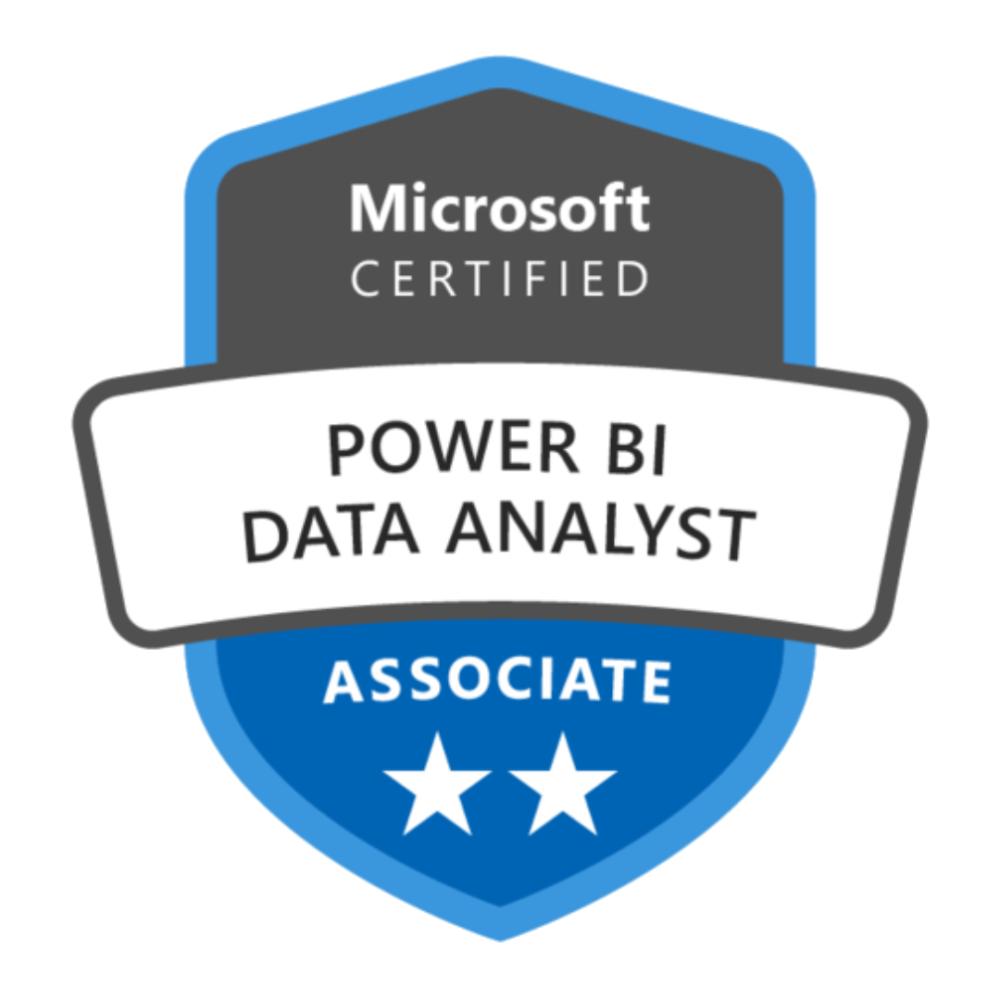
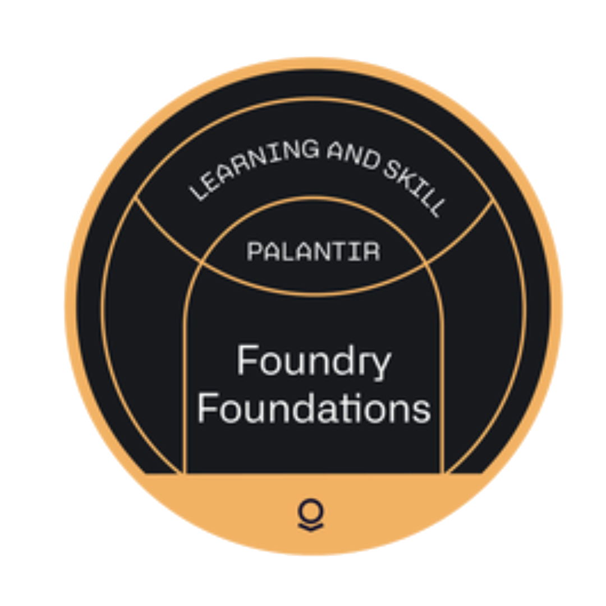

<h3><code>tushar@github ~ $ ./contributions.sh</code></h3>

 
 

<h3><code>tushar@github ~ $ whoami</code></h3>

<table>
<tr>
<td valign="top"></td>
<td valign="top"></td>
</tr>
</table>

 
 

<h3><code>tushar@github ~ $ ./links.sh</code></h3>

<b>Product Owner · AI Data Engineer · Gen AI & LLM Specialist · Data Platform Developer</b>

 

---

# 💫 Hi 👋, I'm Tushar Kashyap  
**Product Owner | AI Data Engineer | Data Engineer | Product Analyst | Gen AI | LLM | RAG**

📩 Email Me 👉 ✉️ **tushar_kashyap@outlook.com** for collaboration, projects, or opportunities  

---

## 🚀 About Me  

- 🔭 **Currently working on:** Agentic AI workflows & enterprise data platforms  
- 🌱 **Currently learning:** Advanced LLM orchestration, multi-agent systems  
- 👯 **Looking to collaborate on:** Data Engineering, Gen AI, Product Management, and BI projects  
- 🤔 **Looking for help with:** Scaling AI systems for production  
- 💬 **Ask me about:** Databricks, PySpark, Power BI, RAG, LLMs, Product Ownership  
- 📫 **Reach me at:** tushar_kashyap@outlook.com  
- ⚡ **Fun fact:** I turn messy data into business decisions 🚀  

---

## 🌐 Connect With Me  

  

---

## 🧠 Professional Summary  

Results-driven **Product Owner and AI Data Engineer with 5+ years of experience** building scalable data pipelines, BI systems, AI-powered analytics platforms, and leading technical product delivery.  

✔ Expertise in **Databricks, PySpark, Power BI, SQL, Azure**  
✔ Strong focus on **LLM, RAG, and AI Agent workflows**  
✔ Proven ability to deliver **high-performance, production-grade systems**  

---

## 💼 Core Impact  

- 🚀 Processed **500M+ records** using distributed data pipelines  
- ⚡ Reduced runtime from **8–9 hrs → 1–2 hrs (~75% optimization)**  
- 📊 Improved dashboard performance by **40%**  
- 🤖 Built **AI-powered insight systems with citation-backed outputs**  

---

## 🏢 Experience  

### 🔹 Product Owner | CIM Group  
- Driving **data & AI product strategy**, requirements, and roadmaps for enterprise platforms  
- Leading cross-functional engineering teams to deliver high-impact data solutions  

### 🔹 Sr. AI Data Engineer | GEO (McSquared.ai)  
- Built **agentic AI workflows** for brand visibility in LLM ecosystems  
- Designed **FastAPI services** for orchestration (prompts, personas, topics)  
- Delivered **automated insight + gap analysis systems**  

### 🔹 Sr. Data Engineer | FIFA (Stagwell)  
- Developed **real-time social intelligence pipelines**  
- Processed **200M+ records using Databricks & PySpark**  
- Optimized performance using **AQE, caching, partitioning**  

### 🔹 Sr. Data Analyst | MARS Veterinary (DataVista BI/AI)  
- Owned **end-to-end Power BI lifecycle**  
- Built **advanced DAX KPIs & semantic models**  
- Improved report speed by **~40%**  

### 🔹 Data Engineer | ID Graph (Stagwell)  
- Built **identity resolution pipelines (UUID-based)**  
- Processed **500M+ records for segmentation systems**  

### 🔹 Data Analyst | Formula One (Connplex)  
- Delivered **product analytics dashboards**  
- Automated **data refresh pipelines**  

---

## 🛠️ Tech Stack  

### 💻 Data & Engineering  

   &nbsp;&nbsp;&nbsp;&nbsp;
   &nbsp;&nbsp;&nbsp;&nbsp;
   &nbsp;&nbsp;&nbsp;&nbsp;
   &nbsp;&nbsp;&nbsp;&nbsp;
  

### 📊 BI & Analytics  

  

### 🤖 AI / Gen AI  

   &nbsp;&nbsp;&nbsp;&nbsp;
   &nbsp;&nbsp;&nbsp;&nbsp;
   &nbsp;&nbsp;&nbsp;&nbsp;
   &nbsp;&nbsp;&nbsp;&nbsp;
  

### ☁️ Cloud & DevOps  

   &nbsp;&nbsp;&nbsp;&nbsp;
   &nbsp;&nbsp;&nbsp;&nbsp;
   &nbsp;&nbsp;&nbsp;&nbsp;
  

---

## 🏆 Certifications & Badges  

<table>
  <tr>
    <td align="center" width="260" valign="top">
        
      <b>Databricks Certified</b> 
      Data Engineer Professional
    </td>
    <td align="center" width="260" valign="top">
        
      <b>Databricks Certified</b> 
      Generative AI Engineer Associate
    </td>
    <td align="center" width="260" valign="top">
        
      <b>Microsoft Certified</b> 
      Fabric Data Engineer (DP-700)
    </td>
  </tr>
  <tr>
    <td align="center" width="260" valign="top">
        
      <b>Microsoft Certified</b> 
      Power BI Data Analyst (PL-300)
    </td>
    <td align="center" width="260" valign="top">
        
      <b>Microsoft Certified</b> 
      Azure Fundamentals (AZ-900)
    </td>
    <td align="center" width="260" valign="top">
        
      <b>Palantir</b> 
      Foundry Foundations
    </td>
  </tr>
</table>

<!-- ---

## 📊 GitHub Stats  

  
    
  
    
  

 -->

---

## 🐍 Contribution Graph  

  

---

<!-- ## 🔝 Top Contributed Repo  

  

--- -->

## ✨ Current Focus  

- 🔥 Agentic AI for enterprise automation  
- ⚡ Lakehouse architecture at scale  
- 📊 BI + AI combined decision systems  

---

⭐️ From [Tushar Kashyap](https://github.com/tusharkz)
